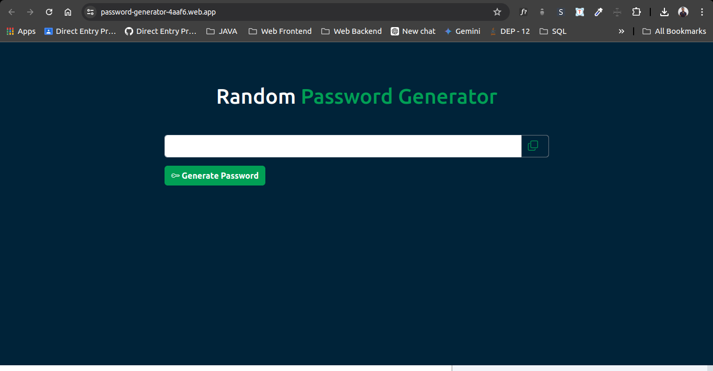
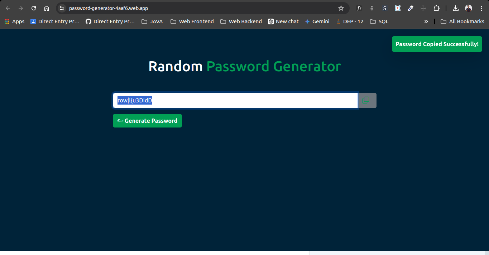

# 🔑 Random Password Generator

A secure and customizable password generator built with HTML, CSS, JavaScript, and Bootstrap.

## 🚀 Features

- Generates secure passwords with a mix of uppercase, lowercase, numbers, and special characters.
- Option to customize the length and complexity of the passwords.
- Responsive design with Bootstrap.

## 🛠️ Technologies Used

- 
- 
- 
- 

## 🌐 Demo Site

Check out the live demo: https://password-generator-4aaf6.web.app/

## 📸 Screenshots




## 📦 Installation

To get started with the Password Generator, follow these steps:

1. **Clone the repository:**

    ```bash
    git clone https://github.com/Rukshan1999/random-password-generator.git
    cd password-generator
    ```

2. **Install the dependencies:**

    ```bash
    npm install
    ```

## 🖥️ Usage

To run the Password Generator locally, open the `index.html` file in your preferred browser. Alternatively, you can use a live server extension in VS Code or a similar tool.


## 🤝 Contributing

Contributions are welcome! Feel free to open an issue or submit a pull request.

## 📝 License

This project is licensed under the MIT License. See the [LICENSE](LICENSE.txt) file for details.

## 👨‍💻 Author

- **Tharindu Rukshan** - [Rukshan1999](https://github.com/Rukshan1999)


